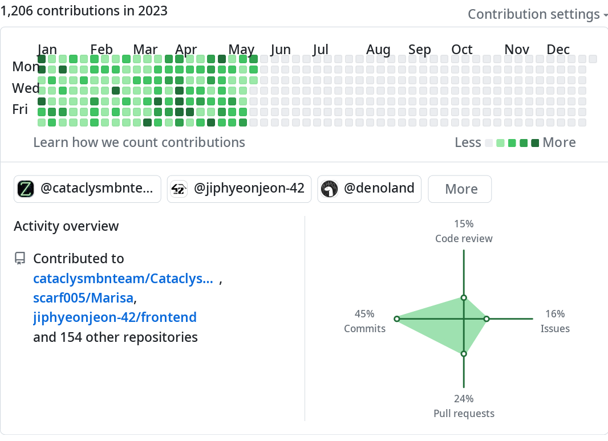

# 김영현

- 이름: 김영현
- 생년월일: 2002-05-11
- 연락처: 010-2480-0511
- GitHub: https://github.com/scarf005

## 소개

- 오픈소스로 세상을 바꾸는 것에 매력을 느낍니다.
- 테스트하고 유지보수하기 쉬운 코드를 작성하기 위해 고민합니다.
- 효율적인 협업을 위한 문서화와 개발 환경 구축에 관심이 있습니다.

## 경험

### [오픈소스](./기여.md)

### 테스트 및 유지보수

### 협업 환경 구축

## 교육

### 42 Seoul

기간: 2021-05/2022-09

### 한국방송통신대학교

기간: 2021-06/재학중
